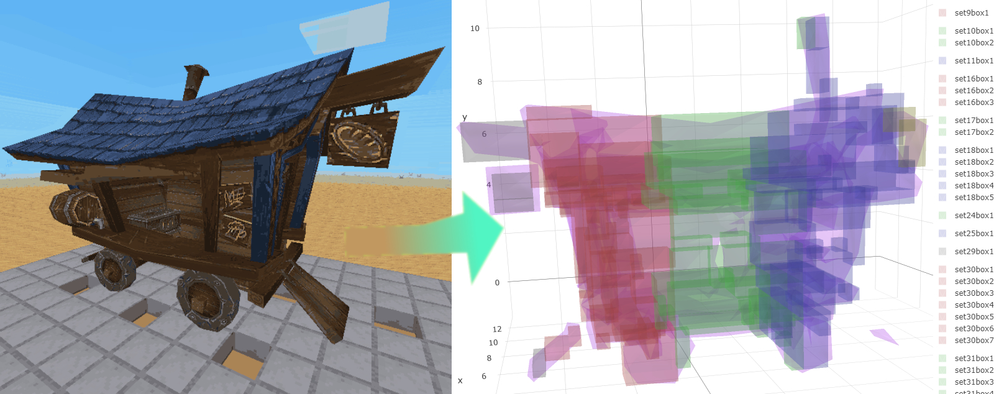

# Boxgen :package:



---

## Getting Started

Boxgen is a set of lua files that consitute a whole program that accepts .obj files and approximates collision boxes for that mesh for Minetest. It is able to, when combined with [autobox](https://github.com/ExeVirus/autobox), represent meshes larger than 3x3x3, which is a minetest specific restriction. It does so by representing a node (block) as multiple nodes, rather than one. These are programmed to act as one, and you can learn more about autobox on it's page later. 

Boxgen is built with customizability in mind. There are different goals of various mod creators for minetest and some want to optimize for accuracy, and some for speed. This project aims to appease both by allowing a user to specify the quality, minimum size, and accuracy of the generated boxes. 

For a much better walkthrough, tutorials, and videos, please visit the [wiki](https://github.com/ExeVirus/boxgen/wiki). 

---

### If you just want to jump in head first, here are the basics:

#### 1. You must have lua (preferrably luajit) installed on your machine or accessible. 
On linux, you can normally just use a package manager to install lua. I fully reccomend **luajit** and not plain lua. For more information, see the [wiki](https://github.com/ExeVirus/boxgen/wiki)

#### 2. Download this repository anywhere to your computer and navigate to that folder.

#### 3. Everything is controlled by run.lua, that is the main program file. To see the help text for the file just run: 
```
lua run.lua -h
```

#### 4. To generate boxes for the provided example.obj file, just execute:

```
lua run.lua 
```
- Two html files will be generated that allow you to view the boxes without loading all of minetest: boxes.html and obj.html. obj.html is just the mesh file, and boxes.html is the mesh + voxel grid used for generation + boxes.

- The output data will be in a file called "data.box", this is to be renamed and used with [autobox](https://github.com/ExeVirus/autobox) 

#### 5. To change the boxing settings, there are four key variables:
- **spacing**: This is the spacing between voxels when voxelizing the object. Smaller is more data points, but slower.
- **minimum fill (minfill)**: This is the minimum percentage any generated box must contain the input mesh. 100% = no box outside of the mesh
- **minimum size (minsize)**: This is the minimum volume a box can be. A normal minetest node is 1x1x1, so if minimum size is 1, then the smallest box would have to have the same volume as a full node. 
- **minimum quality (min-qual)**: This is an advanced parameter that has to do with the algorithm for combining the grid-voxels into boxes. Essentially this parameter stops boxes from growing into areas with really low percentages of voxels. See the wiki for more information, but for now: 0.1 (10%) is a relatively good value. Set to 0.001 for less boxes.

#### 6. Caveats to be aware of:
- Your meshes **must** be watertight, or at least 99.9% watertight to get good results. If you don't know what this means, go see the [wiki page](https://github.com/ExeVirus/boxgen/wiki/Overview-and-Algorithm) on the subject.

- Meshes larger than 3x3x3 (or smaller, but offset from the origin) will require extra nodes to approximate. While this is done as effeciently as possible, these means you cannot merely place your object anywhere you can place a node, you must think of it as a two+ node object, and that can be hard to deal with in some situations (especially larger meshes like a building)

- This program is decently optimized, so it runs pretty fast, but it is using CPU, and so unless you are patient, I recommend using meshes with no more than 1200 triangles, and grid spacing no smaller than 2% of the mesh size (i.e. 0.02 spacing for a node sized object). LuaJIT (5.1) is able to run this program at about 10x the speed of normal lua, I can't recommend it enough. You should never need to use meshes larger than 1200 triangles though, see the [wiki page](https://github.com/ExeVirus/boxgen/wiki/Meshlab-Tutorial) on working with meshes and meshlab. 

---

## To-Be-Completed

5. Finish 1.0 wiki
6. Release mod using this toolset
7. Provide Tutorial Video(s)
8. Provide Tutorial on Using Meshlab to make a simplified watertight mesh for making decent approximations. 
